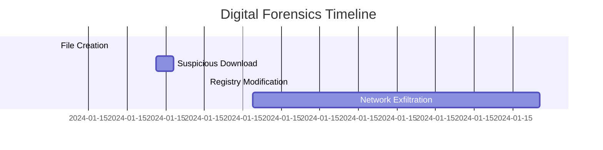

# csvToMermaidGantt

A Python CLI tool that converts CSV files to Mermaid Gantt charts or interactive HTML visualizations, with support for digital forensics timelines.

## Features

- Convert CSV files to Mermaid Gantt chart syntax
- **NEW: Generate interactive HTML with time-synced visualizations**
  - Timeline Charts (Gantt-like bar view)
  - Histograms showing event counts over time
  - Line Graphs for value trends
  - Horizontal zoom synchronization across all charts
  - Individual filtering by file and task name
  - Support for multiple CSV files in combined view
- Support for digital forensics format with timestamps (seconds to years)
- Support for legacy project management format with dates and durations
- Timestamp parsing (ISO 8601, Unix timestamps)
- CLI interface with stdin/stdout support
- 100% test coverage
- Type-checked with mypy
- Linted with flake8
- Formatted with black

## Installation

```bash
pip install -e .
```

For development:

```bash
pip install -e ".[dev]"
```

### Updating After Changes

When you pull new changes from the repository, the editable installation will automatically reflect the changes in the code. However, if you make changes to `pyproject.toml` (such as adding dependencies or changing entry points), you should reinstall:

```bash
pip install -e .
```

This ensures that any configuration changes are properly applied.

## Usage

### Basic usage with file input

```bash
csv-to-mermaid-gantt input.csv
```

### With custom title

```bash
csv-to-mermaid-gantt input.csv -t "My Project Timeline"
```

### Output to file

```bash
csv-to-mermaid-gantt input.csv -o output.md
```

### Setting diagram width

When working with many tasks, the generated Gantt diagram may appear too narrow. You can specify a custom width in pixels:

```bash
csv-to-mermaid-gantt input.csv -w 2000
```

Or with long option:

```bash
csv-to-mermaid-gantt input.csv --width 2000
```

This adds Mermaid configuration to set the diagram width, making it easier to read when exporting as PNG or SVG. As a rule of thumb, allocate roughly 40–60 pixels of width per task row: for small timelines (up to ~20 tasks) use around 1500px, for medium timelines (20–40 tasks) use ~2000px, for larger timelines (40–60 tasks) use ~2500px, and for very large timelines (60+ tasks) consider 3000px or more.

### Using stdin/stdout

```bash
cat input.csv | csv-to-mermaid-gantt > output.md
```

### Interactive HTML Visualizations (NEW)

Generate interactive HTML with time-synchronized charts for digital forensics analysis:

```bash
# Single file with all charts
csv-to-mermaid-gantt input.csv --html -o output.html

# Multiple files for combined analysis
csv-to-mermaid-gantt file1.csv file2.csv file3.csv --html \
  -t "Combined Forensics Timeline" -o timeline.html

# Selective charts
csv-to-mermaid-gantt input.csv --html --no-histogram -o output.html
```

Features of HTML output:
- **Timeline Chart (Gantt View)**: Visualize events on a horizontal timeline
- **Histogram**: See event frequency over time bins
- **Line Graph**: Track numeric values over time (e.g., duration, counts)
- **Synchronized Zoom**: Zooming in one chart updates all others
- **Filtering**: Filter by CSV file source or task name
- **Interactive**: Hover for details, pan, zoom, and reset views

Example with custom options:

```bash
# Generate HTML with custom title and selective charts
csv-to-mermaid-gantt forensics.csv --html \
  -t "Security Incident Timeline" \
  --no-line-graph \
  -o incident.html
```

Chart selection options:
- `--no-timeline`: Disable timeline chart
- `--no-histogram`: Disable histogram
- `--no-line-graph`: Disable line graph

### Verbose mode for debugging

Use the `--verbose` or `-v` flag to see detailed parsing information:

```bash
csv-to-mermaid-gantt input.csv --verbose
```

This will show:
- CSV headers detected
- Field normalization (e.g., `Name` → `task_name`)
- Timestamp parsing details
- Number of tasks processed
- Task combining operations

Useful for troubleshooting CSV format issues.

### Combining tasks with equal names

By default, tasks with the same name are combined if the gap between them is less than 60 seconds. This is useful for forensics timelines where the same activity may be split into multiple entries with small gaps.

```bash
# Use default 60-second threshold
csv-to-mermaid-gantt input.csv

# Use custom threshold (e.g., 120 seconds)
csv-to-mermaid-gantt input.csv -c 120

# Disable combining (keep all tasks separate)
csv-to-mermaid-gantt input.csv -c 0
```

Example CSV with tasks that will be combined:

```csv
Name,start_timestamp,end_timestamp
updTcpIpConnectState,2025-12-12 07:59:00,2025-12-12 08:00:21
updTcpIpConnectState,2025-12-12 08:01:10,2025-12-12 08:02:30
```

With the default 60-second threshold, these two tasks (gap of 49 seconds) will be combined into a single continuous task from `07:59:00` to `08:02:30`.

### As a Python module

```python
from csv_to_mermaid_gantt import convert_csv_to_mermaid

# Legacy format
csv_content = """task_name,start_date,duration,status
Planning,2024-01-01,5d,done
Development,2024-01-06,10d,active"""

mermaid_output = convert_csv_to_mermaid(csv_content, title="My Project")
print(mermaid_output)

# With custom width for better readability
mermaid_output_wide = convert_csv_to_mermaid(
    csv_content, title="My Project", width=2000
)
print(mermaid_output_wide)

# Forensics format with timestamps
forensics_csv = """Name,start_timestamp,end_timestamp
File Access,2024-01-15T09:23:11,2024-01-15T09:23:45
Network Event,1705315200,1705315260"""

forensics_output = convert_csv_to_mermaid(forensics_csv, title="Forensics Timeline")
print(forensics_output)

# With task combining enabled (default: 60 seconds)
combined_csv = """Name,start_timestamp,end_timestamp
Process,2024-01-01 10:00:00,2024-01-01 10:00:30
Process,2024-01-01 10:01:10,2024-01-01 10:02:00"""

# Tasks will be combined (gap is 40 seconds < 60 seconds)
combined_output = convert_csv_to_mermaid(combined_csv, combine_threshold=60)
print(combined_output)

# Disable combining
separate_output = convert_csv_to_mermaid(combined_csv, combine_threshold=None)
print(separate_output)
```

#### Generating HTML Visualizations from Python

```python
from csv_to_mermaid_gantt.html_visualizations import convert_csv_files_to_html

# Single CSV file
csv_files = [
    {
        "name": "forensics_log.csv",
        "content": """Name,start_timestamp,end_timestamp
File Access,2024-01-15T09:23:11,2024-01-15T09:23:45
Network Event,2024-01-15T09:25:45,2024-01-15T09:26:12"""
    }
]

html_output = convert_csv_files_to_html(
    csv_files,
    title="Forensics Analysis",
    show_timeline=True,
    show_histogram=True,
    show_line_graph=True
)

# Save to file
with open("output.html", "w") as f:
    f.write(html_output)

# Multiple CSV files for combined analysis
csv_files = [
    {"name": "System Events", "content": system_csv},
    {"name": "Network Logs", "content": network_csv},
    {"name": "File Access", "content": file_csv}
]

combined_html = convert_csv_files_to_html(
    csv_files,
    title="Multi-Source Timeline Analysis",
    combine_threshold=60  # Combine tasks within 60 seconds
)
```

## CSV Format

The tool supports two CSV formats:

### Digital Forensics Format (with timestamps)

For digital forensics use cases with second-level precision:

```csv
Name,start_timestamp,end_timestamp
File Access,2024-01-01T12:00:45,2024-01-01T12:01:23
Network Connection,1704110400,1704110460
Process Execution,2024-01-01 14:22:33.456789,2024-01-01 14:23:05.123456
```

Supported timestamp formats:
- **Unix timestamp**: Seconds since epoch (e.g., `1704110400`)
- **ISO 8601**: Full datetime with optional microseconds (e.g., `2024-01-01T12:30:45.123456Z`)
- **Space-separated**: Date and time with space (e.g., `2024-01-01 12:30:45`)
- **Date only**: For day-level precision (e.g., `2024-01-01`)

### Legacy Project Management Format

For traditional project management with dates and durations:

```csv
task_name,start_date,duration,status
Planning Phase,2024-01-01,5d,done
Design Phase,2024-01-06,7d,active
Development,2024-01-13,14d,
Testing,2024-01-27,7d,
Deployment,2024-02-03,2d,crit
```

Fields:
- `task_name` or `Name` (required): The name of the task/event
- `start_date` or `start_timestamp` (optional): Start date or timestamp
- `duration` (optional): Duration (e.g., "5d" for 5 days)
- `end_date` or `end_timestamp` (optional): End date or timestamp
- `status` (optional): Task status - `active`, `done`, or `crit` (critical)

### Example: Digital Forensics CSV

```csv
Name,start_timestamp,end_timestamp
File Creation,2024-01-15T09:23:11,2024-01-15T09:23:11
Suspicious Download,2024-01-15T09:25:45,2024-01-15T09:26:12
Registry Modification,2024-01-15T09:27:03,2024-01-15T09:27:03
Network Exfiltration,2024-01-15T09:28:15,2024-01-15T09:35:42
```

### Example Output



### Example: Legacy Format CSV

```csv
task_name,start_date,duration,status
Planning Phase,2024-01-01,5d,done
Design Phase,2024-01-06,7d,active
Development,2024-01-13,14d,
Testing,2024-01-27,7d,
Deployment,2024-02-03,2d,crit
```

### Example Output

```mermaid
gantt
    title Gantt Chart
    dateFormat YYYY-MM-DD
    Planning Phase :planning_phase, done, 2024-01-01, 5d
    Design Phase :design_phase, active, 2024-01-06, 7d
    Development :development, 2024-01-13, 14d
    Testing :testing, 2024-01-27, 7d
    Deployment :deployment, crit, 2024-02-03, 2d
```

## Development

### Running Tests

```bash
pytest
```

### Running Tests with Coverage

```bash
pytest --cov=csv_to_mermaid_gantt --cov-report=term-missing
```

### Type Checking

```bash
mypy csv_to_mermaid_gantt.py tests/
```

### Linting

```bash
flake8 csv_to_mermaid_gantt.py tests/
```

### Formatting

```bash
black csv_to_mermaid_gantt.py tests/
```

### Run All Checks

```bash
# Format code
black csv_to_mermaid_gantt.py tests/

# Lint
flake8 csv_to_mermaid_gantt.py tests/

# Type check
mypy csv_to_mermaid_gantt.py tests/

# Test with coverage
pytest --cov=csv_to_mermaid_gantt --cov-report=term-missing --cov-fail-under=100
```

## License

This project maintains 100% test coverage and follows strict code quality standards using pytest-cov, mypy, flake8, and black formatter.
